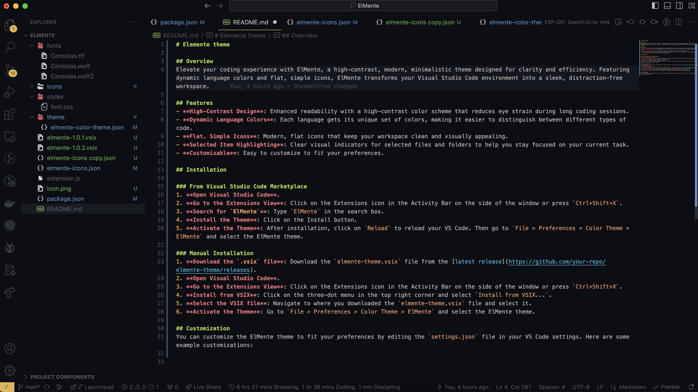

# Elemente theme

## Overview
Elevate your coding experience with ElMente, a high-contrast, modern, minimalistic theme designed for clarity and efficiency. Featuring dynamic language colors and flat, simple icons, ElMente transforms your Visual Studio Code environment into a sleek, distraction-free workspace.

## Features
- **High-Contrast Design**: Enhanced readability with a high-contrast color scheme that reduces eye strain during long coding sessions.
- **Dynamic Language Colors**: Each language gets its unique set of colors, making it easier to distinguish between different types of code.
- **Flat, Simple Icons**: Modern, flat icons that keep your workspace clean and visually appealing.
- **Selected Item Highlighting**: Clear visual indicators for selected files and folders to help you stay focused on your current task.

## Installation

### From Visual Studio Code Marketplace
1. **Open Visual Studio Code**.
2. **Go to the Extensions View**: Click on the Extensions icon in the Activity Bar on the side of the window or press `Ctrl+Shift+X`.
3. **Search for `ElMente`**: Type `ElMente` in the search box.
4. **Install the Theme**: Click on the Install button.
5. **Activate the Theme**: After installation, click on `Reload` to reload your VS Code. Then go to `File > Preferences > Color Theme > ElMente` and select the ElMente theme.

